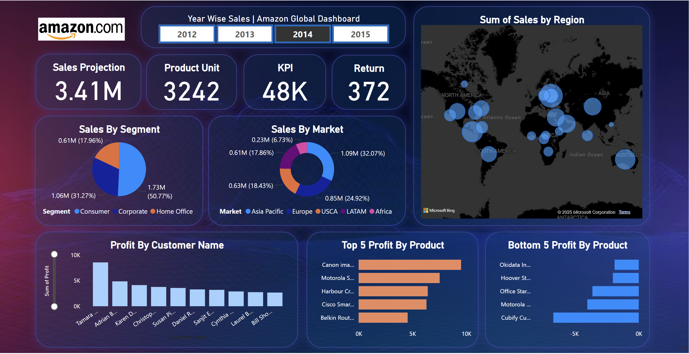

# 🌍 Global Sales Performance Dashboard | Power BI

An interactive dashboard built using Power BI to analyze global sales, profit, and customer behavior using the **Global Superstore** dataset. This project focuses on deriving actionable insights through visual storytelling and data modeling.

---

## 📊 Project Overview

This Power BI dashboard enables dynamic exploration of key business metrics such as:

- 📦 **Sales, Profit, and Quantity** by Country, Category, and Segment  
- 🌐 Regional performance comparisons to identify high and low-performing markets  
- 🧍 Customer behavior patterns and insights across demographics and product types  
- 📈 Trend analysis using time-based filters and custom slicers  

---

## 🚀 Key Features

- **KPI Cards** for quick visualization of performance metrics  
- **Drill-through and Cross-filtering** enabled across all visuals  
- **DAX Measures** for calculated insights like YoY Growth, Profit Ratio, etc.  
- **Interactive Filters**: Country, Segment, Order Date, and more  
- **User-Friendly Layout** with clean design and intuitive navigation  

---

## 🛠 Tools & Technologies Used

- **Power BI Desktop** (Data visualization)
- **Microsoft Excel** (Initial data cleaning)
- **Power Query** (ETL transformations)
- **DAX** (Data modeling and calculated metrics)

---

## 📂 Dataset

The dataset used is the **Global Superstore** dataset, widely used in BI projects and case studies. It includes detailed information on:

- Orders
- Products
- Customers
- Regions
- Profits and Discounts

---

## 💡 Business Impact

- Improved visibility into regional sales distribution  
- Helped identify underperforming product categories  
- Enabled data-driven decision-making with visual insights

---

---
